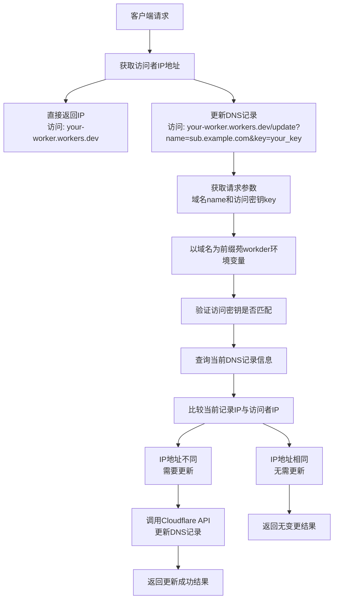

# DDNS Worker

一个简单的 Cloudflare Worker，用于返回访问者的IP地址，并支持自动更新DNS记录。

## 功能

- 直接返回访问者的IP地址
- 支持IPv4地址验证和更新(对A类的域名)
- 支持多域名配置
- 通过API自动更新Cloudflare DNS记录
- 使用访问密钥保护更新操作

## 工作流程



## 前置条件

在使用此 Worker 之前，您需要了解和完成以下设置：

### Cloudflare Workers 简介

Cloudflare Workers 是一个无服务器计算平台，允许您在 Cloudflare 的边缘网络上部署和运行代码，无需管理服务器。

- [Cloudflare Workers 官方文档](https://developers.cloudflare.com/workers/)
- [Workers 快速入门指南](https://developers.cloudflare.com/workers/get-started/guide/)

### 必要的 Cloudflare 设置

1. **创建 Cloudflare 账户**
   - 访问 [Cloudflare 官网](https://www.cloudflare.com/) 注册账户
   - 参考：[Cloudflare 注册指南](https://developers.cloudflare.com/fundamentals/account-and-billing/account-setup/create-account/)

2. **添加域名到 Cloudflare**
   - 将您的域名添加到 Cloudflare 进行管理
   - 参考：[添加站点到 Cloudflare](https://developers.cloudflare.com/fundamentals/get-started/setup/add-site/)

3. **创建 API 令牌**
   - 访问 Cloudflare Dashboard > 个人资料 > API 令牌
   - 创建具有 DNS 编辑权限的令牌
   - 参考：[创建 API 令牌](https://developers.cloudflare.com/fundamentals/api/get-started/create-token/)

4. **获取 Zone ID**
   - 在 Cloudflare Dashboard 中，选择您的域名
   - 在右侧边栏的"API"部分可以找到 Zone ID
   - 参考：[查找 Zone ID](https://developers.cloudflare.com/fundamentals/get-started/basic-tasks/find-account-and-zone-ids/)

5. **设置 DNS 记录**
   - 确保您要更新的 DNS 记录已经存在（A 类型记录）
   - 参考：[管理 DNS 记录](https://developers.cloudflare.com/dns/manage-dns-records/how-to/create-dns-records/)

### 域名路由配置

您可以将 Worker 绑定到自定义域名，而不是使用默认的 workers.dev 域名：

1. **配置自定义域名路由**
   - 在 Cloudflare Dashboard 中，进入 Workers & Pages > 您的Worker > 触发器 > 自定义域
   - 或在 wrangler.toml 中配置路由（见下文）
   - 参考：[自定义域名配置](https://developers.cloudflare.com/workers/configuration/routing/custom-domains/)

2. **wrangler.toml 路由配置示例**
   ```toml
   [routes]
   pattern = "ddns.example.com/*"
   zone_name = "example.com"
   ```

3. **路由模式说明**
   - 您可以使用通配符和路径匹配
   - 参考：[路由模式语法](https://developers.cloudflare.com/workers/configuration/routing/routes/)

## 使用方法

部署后，可以通过以下方式使用：

- **查询当前 IP**：直接访问 `https://your-worker-domain.workers.dev/`
- **更新 DNS 记录**：访问 `https://your-worker-domain.workers.dev/update?name=your_dns_record_name&key=your_access_key`
  - `name`：需要更新的 DNS 记录名称，使用完整域名（如 `subdomain.example.com`）
  - `key`：访问密钥，用于验证更新请求

## 配置说明

Worker 使用环境变量进行配置，支持多域名。每个域名需要配置以下三个环境变量：

```
{your_dns_record_name}__zone_id - 域名所在的 Cloudflare 区域 ID（应设置为加密变量，否则部署时会覆盖）
{your_dns_record_name}__api_token - 用于 Cloudflare API 认证的令牌（应设置为加密变量）
{your_dns_record_name}__access_key - 用于客户端访问验证的密钥（应设置为加密变量）
```

例如，要为 `home.example.com` 配置 DDNS 更新：

```
home.example.com__zone_id
home.example.com__api_token
home.example.com__access_key
```

### 配置环境变量的方法

**在 Cloudflare Dashboard 中配置**：
- 进入 Workers & Pages > your-worker-name > Settings > Variables
- 添加相应的变量或加密变量
- **重要**：所有变量都应设置为加密变量（Secret），以确保在自动部署过程中不会丢失

## 部署方法

### 通过 GitHub 集成自动部署

1. 在 Cloudflare Dashboard 中创建一个新的 Worker 项目
2. 进入 Workers & Pages > 创建应用程序 > 连接到 Git
3. 连接到您的 GitHub 账户并选择包含 DDNS Worker 代码的仓库
4. 配置构建设置：
   - **Build command**: 留空（None）
   - **Deploy command**: `npx wrangler deploy`
   - **Root directory**: `/`
5. 设置生产分支（默认为 `main`）
6. 配置必要的环境变量（见上文的配置说明）
7. 点击"保存并部署"

完成上述步骤后，每当您推送代码到指定的分支，Cloudflare 将自动构建和部署您的 Worker。

## 手动部署方法

如需手动部署：

1. 确保已安装 Node.js 和 npm
2. 安装依赖：
   ```bash
   npm install
   ```
3. 使用 Wrangler 登录 Cloudflare 账号：
   ```bash
   npx wrangler login
   ```
4. 配置环境变量（见上文）
5. 部署项目：
   ```bash
   npm run deploy
   ```
   或
   ```bash
   npx wrangler deploy
   ```

## 本地开发

启动本地开发服务器：
```bash
npm run dev
```

## 技术实现

- 使用 Cloudflare Workers 平台
- 通过 `CF-Connecting-IP` 头获取访问者 IP
- 使用 Cloudflare API 进行 DNS 记录更新
- 支持 IPv4 地址验证

## 许可证

MIT 许可证