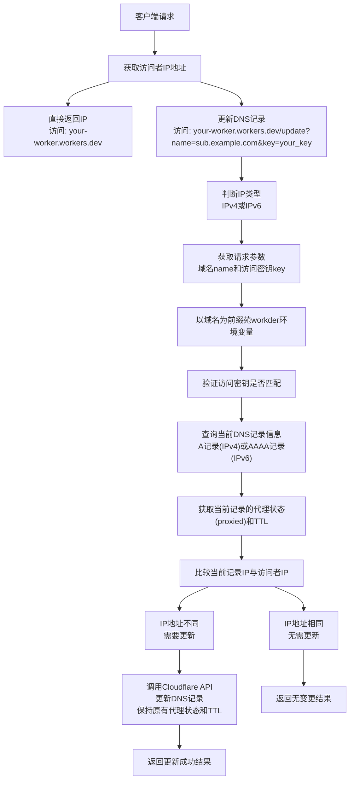

# DDNS Worker

一个简单的 Cloudflare Worker，用于返回访问者的IP地址，并支持自动更新DNS记录。

## 功能

- 直接返回访问者的IP地址
- 支持IPv4地址验证和更新(对A类型的域名)
- 支持IPv6地址验证和更新(对AAAA类型的域名)
- 支持多域名配置
- 通过API自动更新Cloudflare DNS记录
- 使用访问密钥保护更新操作
- 保持原有DNS记录的代理状态(proxied)和TTL设置

## 工作流程



## 部署方法
### worker的代码部署
1. 将本[ddns-worker](https://github.com/zhyhang/ddns-worker)工程fork到自己的github账户下（**也可以通过将index.js直接上传到worker的代码编辑框，就不用执行以下步骤了**）
1. 在 Cloudflare Dashboard 中创建一个新的 Worker 项目
2. 进入 Workers & Pages > 创建应用程序 > 连接到 Git（或在settings界面中设置build）
3. 连接到您的 GitHub 账户并选择包含 DDNS Worker 代码的仓库
4. 配置构建设置：
   - **Build command**: 留空（None）
   - **Deploy command**: `npx wrangler deploy`
   - **Root directory**: `/`
5. 设置生产分支（默认为 `main`）
6. 配置必要的环境变量（见下文的worker中配置环境变量）
7. 点击"保存并部署"

完成上述步骤后，**每当您推送代码到指定的分支**，Cloudflare 将自动构建和部署您的 Worker。
### woker中配置环境变量

**在 Cloudflare Dashboard 中配置**：
- 进入 Workers & Pages > your-worker-name > Settings > Variables
- 添加相应的变量或加密变量
- **重要**：所有变量都应设置为加密变量（Secret），以确保在自动部署过程中不会丢失

本程序可支持多域名，每个域名需要配置以下三个环境变量：
```bash
{your_dns_record_name}__zone_id - 域名所在的 Cloudflare 区域 ID（应设置为加密变量，否则部署时会覆盖）
{your_dns_record_name}__api_token - 用于 Cloudflare API 认证的令牌（应设置为加密变量）
{your_dns_record_name}__access_key - 用于客户端访问验证的密钥（应设置为加密变量）
```
例如，要为 `my.example.com` 配置 DDNS 更新：
```bash
my.example.com__zone_id
my.example.com__api_token
my.example.com__access_key
```
## 使用方法
### 手工调用：

- **查询当前 IP**：直接访问 `https://your-worker-domain.workers.dev/`(修改route后可以为https://worker.example.com)
- **更新 DNS 记录**：访问 `https://your-worker-domain.workers.dev/update?name=your_dns_record_name&key=your_access_key`
  - `name`：需要更新的 DNS 记录名称，使用完整域名（如 `my.example.com`）
  - `key`：访问密钥，用于验证更新请求，要等于worker中的my.example.com__access_key值

**注意**：系统会自动检测您的 IP 类型（IPv4 或 IPv6），并更新相应类型的 DNS 记录（A 记录或 AAAA 记录）。请确保您的域名已经配置了相应类型的 DNS 记录。

### 使用 crontab 自动更新
您可以在Linux主机（**希望将其所在网络的公网出口IP作为dns解析ip**）上使用 crontab 设置定时任务，自动更新您的 DNS 记录：

1. **编辑 crontab**：
   ```bash
   crontab -e
   ```
2. **添加定时任务**：

   **每分钟更新一次**：
   ```bash
   * * * * * /usr/bin/curl -4 -s "https://worker.example.com/update?name=your.example.com&key=your_access_key" > /dev/null 2>&1
   ```

   **每小时更新一次**（推荐）：
   ```bash
   0 * * * * /usr/bin/curl -4 -s "https://worker.example.com/update?name=your.example.com&key=your_access_key" > /dev/null 2>&1
   ```
   > **注意**：
   > - 使用完整路径 `/usr/bin/curl` 避免环境变量问题（可通过 `which curl` 命令查找您系统上的curl路径）
   > - 使用 `-4` 参数强制使用 IPv4 连接
   > - `-s` 参数使 curl 静默运行，不输出进度或错误信息
   > - `> /dev/null 2>&1` 将所有输出重定向到空设备，防止 cron 发送邮件
## Cloudflare Workers 简介

Cloudflare Workers 是一个无服务器计算平台，允许您在 Cloudflare 的边缘网络上部署和运行代码，无需管理服务器。

- [Cloudflare Workers 官方文档](https://developers.cloudflare.com/workers/)
- [Workers 快速入门指南](https://developers.cloudflare.com/workers/get-started/guide/)

### 必要的 Cloudflare 设置

1. **创建 Cloudflare 账户**
   - 访问 [Cloudflare 官网](https://www.cloudflare.com/) 注册账户
   - 参考：[Cloudflare 注册指南](https://developers.cloudflare.com/fundamentals/account-and-billing/account-setup/create-account/)

2. **添加域名到 Cloudflare**
   - 将您的域名添加到 Cloudflare 进行管理
   - 参考：[添加站点到 Cloudflare](https://developers.cloudflare.com/fundamentals/get-started/setup/add-site/)

3. **创建 API 令牌**
   - 访问 Cloudflare Dashboard > 个人资料 > API 令牌
   - 创建具有 DNS 编辑权限的令牌
   - 参考：[创建 API 令牌](https://developers.cloudflare.com/fundamentals/api/get-started/create-token/)

4. **获取 Zone ID**
   - 在 Cloudflare Dashboard 中，选择您的域名
   - 在右侧边栏的"API"部分可以找到 Zone ID
   - 参考：[查找 Zone ID](https://developers.cloudflare.com/fundamentals/get-started/basic-tasks/find-account-and-zone-ids/)

5. **设置 DNS 记录**
   - 确保您要更新的 DNS 记录已经存在（A 类型记录）
   - 参考：[管理 DNS 记录](https://developers.cloudflare.com/dns/manage-dns-records/how-to/create-dns-records/)

### 修改worker域名（可选）

您可以将 Worker 绑定到自定义域名（**这个域名是worker的地址，不是你想动态绑定的域名**），而不是使用默认的 workers.dev 域名：

1. **配置自定义域名路由**
   - 在 Cloudflare Dashboard 中，进入 Workers & Pages >  your-worker-name > Settings > Domains & Routes 中配置route

2. **路由模式说明**
   - 您可以使用通配符和路径匹配
   - 参考：[路由模式语法](https://developers.cloudflare.com/workers/configuration/routing/routes/)


## 技术实现

- 使用 Cloudflare Workers 平台
- 通过 `CF-Connecting-IP` 头获取访问者 IP
- 支持 IPv4 和 IPv6 地址验证
- 使用 Cloudflare API 进行 DNS 记录更新
- 自动识别 IP 类型并更新相应的 DNS 记录类型（A 或 AAAA）
- 保持原有 DNS 记录的代理状态(proxied)和 TTL 设置

## 许可证

MIT 许可证